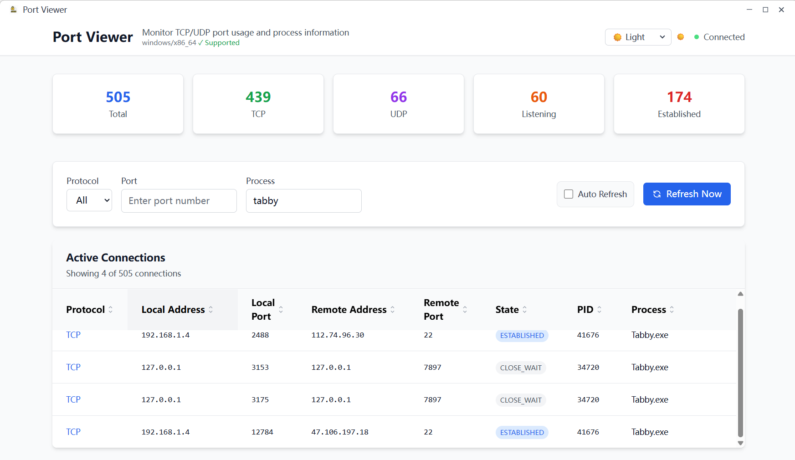

# Port Viewer

A cross-platform desktop application built with Rust and Tauri 2, used to view network port usage and process information.

## 💻 Supported Systems

### Windows
- **Windows 7+** 

### Linux
- **Distributions**: Ubuntu 18.04+, Debian 10+, CentOS 8+, Fedora 32+
- **Kernel Version**: Linux kernel 2.6+
- **Architecture Support**: x86_64, ARM64

### macOS
- **Version Support**: macOS 10.15 (Catalina) or higher
- **Architecture Support**: x86_64, Apple Silicon (M1/M2)

## 🤝 Contributing

We welcome contributions! Please feel free to submit issues and pull requests.

### Development Guidelines
1. Fork the repository
2. Create a feature branch
3. Make your changes with proper testing
4. Follow code style: Run `cargo fmt` and `cargo clippy`
5. Submit a Pull Request

## 📜 License

This project is open source. Please refer to the license file for details.

---

**💬 Questions or suggestions?** Feel free to open an issue or start a discussion!

**⭐ Like this project?** Give it a star on GitHub to show your support!

**Built with ❤️ by developers, for developers.**
